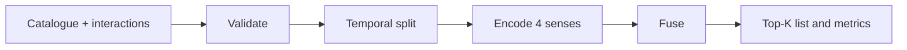
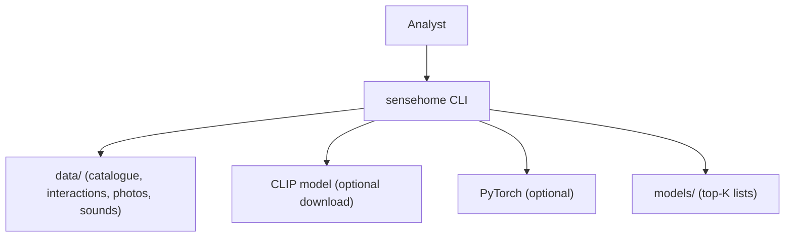
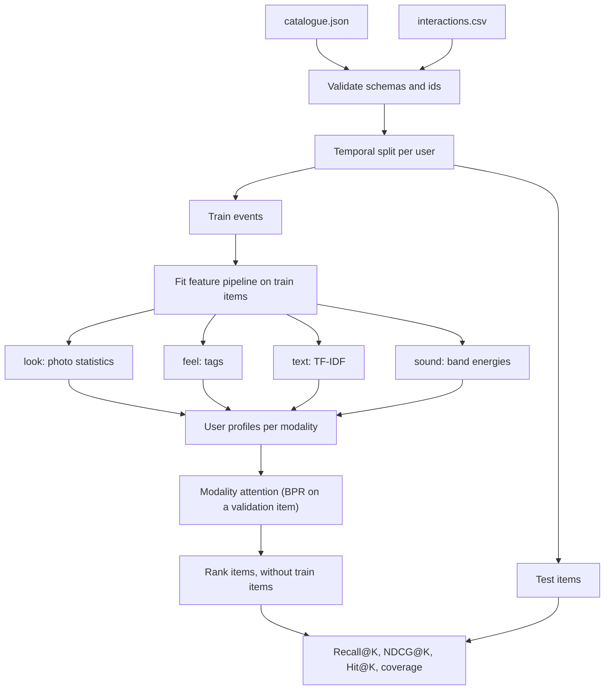

<div align="center">

# sensehome — Multi-Sensory Furniture Recommender

**sensehome is a recommender for furniture shops that want to use how an item looks, feels, reads and sounds. It takes a catalogue and an interaction log through these steps to a ranked, explained list for each user:**

`validate catalogue` → `temporal split` → `encode each sense` → `fuse with attention` → `rank and evaluate`.


**[Summary](#1-summary)** ·
**[Workflow](#4-the-end-to-end-workflow)** ·
**[Run it](#10-how-to-run-sensehome)** ·
**[Configuration](#104-environment-variables)** ·
**[Known problems](#13-known-problems)** ·
**[Glossary](#15-glossary)**

</div>

> [!NOTE]
> This README uses ASD-STE100 Simplified Technical English. The writing rules and the project
> vocabulary are in [`docs/ste-style-guide.md`](docs/ste-style-guide.md). Each term in the
> [Glossary](#15-glossary) has only one meaning.

---

sensehome recommends furniture items from four senses of each item.
The senses are the photo (`look`), the material and texture tags (`feel`), the text (`text`) and an optional tap sound (`sound`).
All four modalities belong to the same `item_id`, and the labels come from user interactions.
A modality attention model learns how much each sense counts for each user.
Ablations show the value of each sense. All results in this README come from synthetic data.

This README is the **one location that explains all of sensehome**. It gives these topics:

- the general design
- each component and its procedure, step by step
- the decision rules
- the data map
- the runbook
- the validation results and the known problems

| If you are… | Read |
|---|---|
| A manager or reviewer | [1](#1-summary), [3](#3-design-rules), [4](#4-the-end-to-end-workflow), [12](#12-validation-results), [14](#14-key-points) |
| A developer who joins the project | All sections, in sequence. Keep [10](#10-how-to-run-sensehome) and [13](#13-known-problems) open while you work |
| An operator who runs sensehome | [10](#10-how-to-run-sensehome), then the section for the component that you use |

---

## Table of contents

1. 🧭 [Summary](#1-summary)
2. 🏗️ [How sensehome is built](#2-how-sensehome-is-built)
   - 2.1 [Components](#21-components)
   - 2.2 [System context](#22-system-context)
   - 2.3 [Repository layout](#23-repository-layout)
3. 🛡️ [Design rules](#3-design-rules)
4. 🔄 [The end-to-end workflow](#4-the-end-to-end-workflow)
   - 4.1 [Full flow](#41-full-flow)
   - 4.2 [The life cycle of one recommendation](#42-the-life-cycle-of-one-recommendation)
5. 🔵 [The catalogue, the interactions and the split](#5-the-catalogue-the-interactions-and-the-split)
6. 🟢 [The encoders and the feature pipeline](#6-the-encoders-and-the-feature-pipeline)
7. 🟣 [The recommenders](#7-the-recommenders)
8. ⚖️ [The decision rules](#8-the-decision-rules)
9. 🗂️ [Data and file map](#9-data-and-file-map)
10. ▶️ [How to run sensehome](#10-how-to-run-sensehome)
    - 10.1 [Prerequisites](#101-prerequisites) · 10.2 [Installation](#102-installation) · 10.3 [Run sensehome](#103-run-sensehome) · 10.4 [Environment variables](#104-environment-variables)
11. 🧩 [How to extend sensehome](#11-how-to-extend-sensehome)
12. ✅ [Validation results](#12-validation-results)
13. ⚠️ [Known problems](#13-known-problems)
14. 📌 [Key points](#14-key-points)
15. 📖 [Glossary](#15-glossary)
16. 📄 [License](#16-license)

---

## 1. Summary

**The problem.** A shop wants to recommend furniture from what an item looks like and feels like, not only from what other people bought. These questions are difficult:

- How do you make sure that the photo, the tags and the sound describe the same item?
- Where do the labels come from, if not from random numbers?
- Which senses add value, and which senses only add noise?
- How do you fuse the senses, when users care about different senses?
- How do you evaluate without leakage from the future?

sensehome gives each of these questions its own component. Each component has typed data and unit tests.

| Item | Value |
|---|---|
| Input | `catalogue.json` (items) and `interactions.csv` (user events) |
| Output | A top-K list for each user, with modality weights and modality scores |
| Components | **11** modules: config, schemas, synthetic, media, encoders, split, models, torch_models, metrics, evaluate, cli |
| Providers | CLIP image encoder and a PyTorch two-tower model. Both are optional |
| Offline mode | Synthetic catalogue, synthetic media, all NumPy models and the evaluation. No download |
| Safety | No interaction without a catalogue item. No test event earlier than a train event of the same user |
| Tests | **30** pass in CI (`.[dev]` only) and 1 skips (`torch` extra). With the `torch` extra, all 31 pass |



---

## 2. How sensehome is built

### 2.1 Components

| Component | Module | Purpose |
|---|---|---|
| Settings | `src/sensehome/config.py` | Environment variables |
| Schemas | `src/sensehome/schemas.py` | `Item`, `Interaction`, `Dataset`, loaders, alignment checks |
| Synthetic data | `src/sensehome/synthetic.py` | Catalogue, photos, tap sounds and users with hidden tastes |
| Media | `src/sensehome/media.py` | Photo and sound of an item, from a file or a synthetic reference |
| Encoders | `src/sensehome/encoders.py` | One encoder for each sense and the `FeaturePipeline` |
| Split | `src/sensehome/split.py` | Temporal split for each user with leakage checks |
| Models | `src/sensehome/models.py` | `Popularity`, `ContentProfile`, `ModalityAttention`, `FeatureBPR` |
| Two-tower model | `src/sensehome/torch_models.py` | Optional PyTorch model with attention fusion |
| Metrics | `src/sensehome/metrics.py` | Recall@K, NDCG@K, Hit@K, bootstrap intervals |
| Evaluation | `src/sensehome/evaluate.py` | The suite: baselines, single-sense models, fusion, ablations |
| CLI | `src/sensehome/cli.py` | The `sensehome` command with 5 subcommands |

### 2.2 System context



### 2.3 Repository layout

```
sensehome/
├── .github/workflows/ci.yml   # CI: Python 3.11, pip install -e ".[dev]", pytest -q
├── data/README.md             # schemas, sources and licences (data files are git-ignored)
├── docs/ste-style-guide.md    # writing rules and project vocabulary
├── src/sensehome/             # the 11 modules in 2.1
├── tests/                     # 31 unit tests (1 needs the torch extra), synthetic data only
├── .env.example               # variable names only
└── pyproject.toml             # core deps: numpy, pydantic. Extras: media, clip, torch, dev
```

---

## 3. Design rules

### 3.1 One item, one id, all senses
`Dataset` rejects duplicate item ids and each interaction that names an unknown item. The photo, the tags, the text and the sound are fields of the same `Item`. The code never pairs files by their position in a folder.

### 3.2 Labels come from behaviour
The target of the model is the set of items that a user interacted with later in time. In the synthetic data, users choose items from hidden tastes, so the labels have a real signal. A test checks this.

### 3.3 No leakage from the future
`temporal_user_split` keeps the last 20 % of each user's events for test. `Split.check` fails if a test item is in the same user's train history. The feature pipeline is fit on the items of the train events only.

### 3.4 A missing sense is neutral
Each modality has a mask. An item without a sound gets a modality score of 0 for `sound`. The attention softmax leaves out a modality that a user profile does not have.

### 3.5 Equal scale for each sense
The modality scores are z-scores over the items that have the modality. Without this step, the short, dense sound vectors controlled the sum.

### 3.6 Baselines and ablations first
Each run includes popularity, plain BPR, each sense alone and each sense left out. A sense that does not improve the result is visible in the table.

### 3.7 Light core, optional heavy parts
The core needs only NumPy and Pydantic. PyTorch, CLIP, Pillow and soundfile load only when you use them. A test checks that the core import loads no deep-learning framework.

---

## 4. The end-to-end workflow

### 4.1 Full flow



### 4.2 The life cycle of one recommendation

1. Load and validate the catalogue and the interactions.
2. Split the events of each user by time.
3. Fit the encoders and the standardisation on the train items.
4. Encode each modality of each item and set the masks.
5. Make a profile for each user and each modality.
6. Calculate the modality scores of all items for the user.
7. Weight the modality scores with the attention weights of the user.
8. Remove the user's train items and keep the top K items.
9. Show the weights and the modality scores as the explanation.

---

## 5. The catalogue, the interactions and the split

**Purpose.** Give the models clean, aligned data and a split without leakage.

| Input | Output |
|---|---|
| `catalogue.json`, `interactions.csv` | `Dataset`, `Split` (train events, test items for each user) |

**Procedure**

1. Validate each item: category, materials and textures from fixed lists, a licence, no extra fields.
2. Validate each interaction: user, item, integer timestamp, event `view`, `save` or `purchase`.
3. Reject duplicate item ids and interactions with an unknown item.
4. Keep the first event of each user and item pair.
5. Sort each user's events by time and keep the last 20 % (minimum 1) for test.
6. If fewer than 3 train events remain for a user, keep all events of that user in train.

**The synthetic data**

| Part | How it is made |
|---|---|
| Items | 240 items. Each has a hidden style (5) and colour (12). The material follows the style in 80 % of items. The texture follows the material |
| Photo | 24 × 24 RGB array: the colour plus the pattern of the texture (checks for `woven`, stripes for `ribbed`, streaks for `brushed`, and others) |
| Tap sound | 0.25 s at 8 kHz: decaying partials at the frequency of the material. About 58 % of items have a sound |
| Text | Title and description from style words, colour, material, category, texture and a filler phrase |
| Users | 300 users with hidden style, colour, texture and material tastes and a hidden look-or-feel weight |
| Events | About 20 for each user, chosen with a softmax (temperature 0.15) of the user's utility |

---

## 6. The encoders and the feature pipeline

**Purpose.** Change each sense of an item into a vector, with the state fit on train items only.

| Modality | Offline encoder | Dimensions | Optional encoder |
|---|---|---|---|
| `look` | 4×4×4 colour histogram, mean colour, gradient energy in x and y, gray level spread, 4 FFT band energies | 75 | `CLIPImageEncoder` (ViT-B/32) |
| `feel` | Multi-hot material and texture tags | 18 | none |
| `text` | TF-IDF over title and description, vocabulary from train items | vocabulary size | none |
| `sound` | 16 log-spaced band energies (dB), spectral centroid, decay | 18 | none |

**Procedure**

1. Fit each encoder on the train items (the text vocabulary and the IDF values).
2. Encode the train items and store the mean and the standard deviation of each dimension.
3. For each item, encode each modality, standardise it and scale it to unit length.
4. If the item does not have the modality, store a zero row and set the mask to false.

---

## 7. The recommenders

**Purpose.** Rank the items for each user.

| Model | Idea | Learned parameters |
|---|---|---|
| `popularity` | Sum of event weights for each item | none |
| `content[...]` | Equal-weight sum of modality scores (concatenation fusion) | none |
| `attention[...]` | Weighted sum of modality scores. Weights = softmax(θ + β × consistency of the user) | θ (one for each modality), β |
| `bpr` | Matrix factorisation with BPR loss | user and item vectors, item bias |
| `bpr+features` | BPR where the item vector = free vector + W × item features | as `bpr`, plus W |
| `two-tower+attention` | PyTorch: projection for each modality, additive attention for each item, item id vector, user vector, BPR loss | all layers |

**Procedure of the modality attention model**

1. Hold out the last train item of each user as a validation item.
2. Make the profiles from the other train items.
3. For each user, pair the validation item with 20 sampled items that the user did not see.
4. Do 200 steps of gradient ascent on the BPR log-likelihood for θ and β (learning rate 0.5).
5. Make the final profiles from all train items.

**Rules**

- The event weight is 1 for `view`, 2 for `save` and 3 for `purchase`.
- A model never ranks an item from the user's train history.
- `recommend` shows the attention weights and the score of each modality for each item.

---

## 8. The decision rules

| Setting | Value | Where |
|---|---|---|
| Test share for each user | 20 % (minimum 1 event) | `temporal_user_split` |
| Minimum train events | 3 | `temporal_user_split` |
| K | 10 (`SENSEHOME_K`) | CLI |
| Event weights | view 1, save 2, purchase 3 | `models.EVENT_WEIGHT` |
| Attention training | 200 steps, learning rate 0.5, 20 negatives | `ModalityAttention` |
| BPR | dimension 32, 30 epochs, learning rate 0.05, L2 1e-4, batch 256 | `FeatureBPR` |
| Two-tower | dimension 32, 40 epochs, Adam 1e-2, weight decay 1e-5 | `TwoTowerAttention` |
| Bootstrap | 1000 samples over test users, 95 % percentile interval | `metrics.bootstrap_mean_ci` |
| Seed | 7 (`SENSEHOME_SEED`) | data and models |

**Metrics**

| Metric | Meaning |
|---|---|
| Recall@K | Share of a user's test items in the top K, averaged over users |
| NDCG@K | Discounted gain of the test items in the top K, divided by the best possible gain |
| Hit@K | Share of users with at least one test item in the top K |
| Coverage | Share of catalogue items that are in at least one top-K list |

---

## 9. Data and file map

| Path | Committed? | Contents |
|---|---|---|
| `data/README.md` | Yes | Schemas, sources, licences |
| `data/synthetic/` | No (git ignores it) | Output of `sensehome generate` |
| `data/*` (other files) | No (git ignores it) | Your catalogue, interactions, photos and sounds |
| `models/recommendations.json` | No (git ignores it) | Output of `sensehome train` |
| `*.png`, `*.jpg`, `*.wav`, `*.npz`, `*.pt` | No (git ignores it) | Media and model files |
| `.env` | No (git ignores it) | Local settings |

---

## 10. How to run sensehome

### 10.1 Prerequisites

| Need | For |
|---|---|
| Python 3.11+ | All components |
| Extra `media` | Real photos and WAV files |
| Extra `clip` | CLIP image embeddings |
| Extra `torch` | The two-tower model (`evaluate --torch`) |

### 10.2 Installation

```bash
git clone https://github.com/KrishnaAnnavaram/sensehome.git
cd sensehome
python -m venv .venv
. .venv/bin/activate            # Windows: .venv\Scripts\activate
pip install -e ".[dev]"
```

### 10.3 Run sensehome

```bash
# Offline demo on synthetic data
sensehome generate --out data/synthetic
sensehome validate --data data/synthetic
sensehome evaluate --data data/synthetic                  # all models and ablations
sensehome evaluate --seeds 7,11,23,31,47                  # repeat on 5 synthetic data sets
sensehome train --model attention --out models/recommendations.json
sensehome recommend --user u0003 --k 5                    # with modality weights

# Optional learned two-tower model
pip install -e ".[torch]"
sensehome evaluate --torch

# Your own data
pip install -e ".[media]"
sensehome validate --data data/myshop
sensehome evaluate --data data/myshop
```

### 10.4 Environment variables

| Variable | Used by | Meaning |
|---|---|---|
| `SENSEHOME_DATA_DIR` | CLI | Data folder, default `data/synthetic` |
| `SENSEHOME_MODEL_DIR` | `train` | Output folder, default `models` |
| `SENSEHOME_SEED` | all | Random seed, default 7 |
| `SENSEHOME_K` | `evaluate`, `train`, `recommend` | List length, default 10 |
| `SENSEHOME_IMAGE_ENCODER` | settings | `histogram` (default) or `clip` |

sensehome needs no API key. Local settings are only in a `.env` file. Git ignores this file.

---

## 11. How to extend sensehome

| You want to… | Do this | Code change? |
|---|---|---|
| Use your own catalogue | Write `catalogue.json` and `interactions.csv` (see `data/README.md`) | No |
| Use CLIP for photos | Pass `CLIPImageEncoder()` in the `FeaturePipeline` encoder list | Small |
| Add a sense | Write an encoder with `name`, `fit` and `raw`, and add it to the pipeline | Small |
| Add a material or a texture | Add it to `MATERIALS` or `TEXTURES` in `schemas.py` | Small |
| Add a model | Subclass `Recommender` with `fit` and `scores`, and pass it as `extra` to `run_suite` | Small |

---

## 12. Validation results

All numbers come from synthetic data. They show that the pipeline and the evaluation work. They are not results on real shoppers.

| Validation | Result | Command |
|---|---|---|
| Unit tests | CI installs only `.[dev]`: **30 passed**, 1 skipped (`torch` extra). With the extras: 31 passed | `pytest -q` |

**One run (seed 7): 240 items, 300 users, 4,713 train events, 300 test users, K = 10**

| Model | Recall@10 (95 % CI) | NDCG@10 | Hit@10 | Coverage |
|---|---|---|---|---|
| `popularity` | 0.080 (0.065 to 0.096) | 0.062 | 0.273 | 0.07 |
| `content[look]` | 0.142 (0.121 to 0.165) | 0.107 | 0.433 | 0.97 |
| `content[feel]` | 0.154 (0.131 to 0.176) | 0.119 | 0.453 | 0.93 |
| `content[text]` | 0.180 (0.159 to 0.205) | 0.132 | 0.513 | 1.00 |
| `content[sound]` | 0.072 (0.056 to 0.086) | 0.050 | 0.263 | 0.57 |
| `content[look+feel+text+sound]` | 0.201 (0.177 to 0.226) | 0.152 | 0.563 | 1.00 |
| `content[feel+text+sound]` (no look) | 0.187 (0.163 to 0.209) | 0.131 | 0.533 | 0.99 |
| `content[look+text+sound]` (no feel) | 0.186 (0.163 to 0.212) | 0.140 | 0.510 | 0.99 |
| `content[look+feel+sound]` (no text) | 0.175 (0.148 to 0.199) | 0.130 | 0.483 | 0.98 |
| `content[look+feel+text]` (no sound) | **0.209** (0.183 to 0.235) | 0.164 | 0.573 | 1.00 |
| `attention[look+feel+text+sound]` | 0.208 (0.183 to 0.233) | 0.158 | 0.567 | 1.00 |
| `bpr` | 0.132 (0.112 to 0.152) | 0.100 | 0.413 | 0.97 |
| `bpr+features` | 0.135 (0.116 to 0.154) | 0.107 | 0.443 | 0.97 |
| `two-tower+attention` (PyTorch) | 0.147 (0.124 to 0.170) | 0.112 | 0.433 | 1.00 |

**Five synthetic data sets (seeds 7, 11, 23, 31, 47), Recall@10**

| Model | Mean | Standard deviation |
|---|---|---|
| `popularity` | 0.081 | 0.005 |
| `content[look+feel+text+sound]` | 0.206 | 0.008 |
| `attention[look+feel+text+sound]` | 0.213 | 0.016 |
| `bpr` | 0.129 | 0.014 |
| `bpr+features` | 0.142 | 0.009 |

What the numbers show:

- Each sense alone beats popularity, except `sound`. Its items are only 58 % of the catalogue.
- The run without `sound` is not worse than the run with all four senses. A sense that does not add value can be removed.
- The modality attention model is 0.007 better than concatenation on the 5-seed mean. The difference is smaller than the spread, so it is not proven.
- Item features improve BPR a little (0.142 against 0.129). The content models are better on this small, sparse data.
- The earlier prototype reported an accuracy of about 50 % with random labels. That is a prototype result, not reproduced here, and it had no meaning.

---

## 13. Known problems

Read these problems before you use sensehome in production.

| # | Area | Problem | Impact and action |
|---|---|---|---|
| 1 | Data | All results come from synthetic data with known structure | Collect real interactions and photos with a licence, then run `evaluate` again |
| 2 | Synthetic data | Text descriptions contain the hidden attributes, so `text` is strong by design | Do not read the ranking of the senses as a fact about real shoppers |
| 3 | Attention | The gain over concatenation is small and not significant | Keep concatenation as the default comparison in each report |
| 4 | Two-tower | The PyTorch model is not tuned and is below the content models | Tune it on real data, or use it only for large catalogues |
| 5 | Sound | Few real products have a recorded sound | Leave `sound` empty when there is no real recording |
| 6 | Cold start | New users with fewer than 3 events get no test split and no profile | Use popularity for new users |
| 7 | Encoders | The offline photo encoder sees only colour and simple texture statistics | Use CLIP (extra `clip`) for real photos |
| 8 | Bias | Popularity and content models repeat the past taste of a user | Check coverage and diversity before a launch |

---

## 14. Key points

1. **All senses belong to one item id.** The schema rejects unknown items and duplicates.
2. **Labels come from behaviour.** The target is the user's later interactions, not random numbers.
3. **The split is temporal and checked.** The feature pipeline is fit on train items only.
4. **Ablations decide which senses stay.** On synthetic data, the tap sound adds nothing.
5. **The attention is real.** It is learned with BPR and it can ignore a noise modality, as a test shows.
6. **Everything runs offline.** The demo and the 30 CI tests need no download and no key.

---

## 15. Glossary

| Term | Meaning |
|---|---|
| **Item** | One furniture product with one `item_id` |
| **Catalogue** | The validated list of items |
| **Interaction** | One `view`, `save` or `purchase` event of a user on an item |
| **Modality** | One sense of an item: `look`, `feel`, `text` or `sound` |
| **Encoder** | The component that changes one modality into a vector |
| **Feature pipeline** | The encoders and the standardisation, fit on train items |
| **Mask** | The flag that tells if an item has a modality |
| **Profile** | The weighted mean vector of a user's train items in one modality |
| **Consistency** | The length of a profile |
| **Modality score** | The standardised similarity of an item to a profile |
| **Attention weight** | The softmax weight of a modality |
| **Concatenation fusion** | The equal-weight sum of the modality scores |
| **Split** | The temporal train and test partition of the interactions |
| **Baseline** | `popularity` or plain `bpr` |
| **Ablation** | A run with one modality removed, or with one modality only |
| **BPR** | Bayesian personalised ranking: a loss that prefers a seen item to an unseen item |
| **Recall@K** | The share of a user's test items in the top K |
| **NDCG@K** | Normalised discounted cumulative gain in the top K |

---

## 16. License

[MIT](LICENSE) © 2026 Krishna Annavaram
